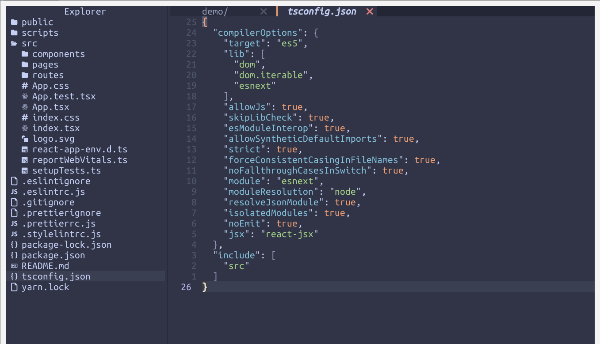

# simple-tree.nvim

> | English | [中文](./README_ZH.md) |

<div align="center">
  <h3>A Tree Plugin  For <code>Neovim</code>.</h3>
  
</div>

## Intro

`simple-tree` is a Neovim plugin to browse the file system

## Requirements

- This plugin only works in Neovim 0.5 or newer.

- [nerd font](https://www.nerdfonts.com/) is optional and used to display file icons.If you want it, the font of your terminal emulator must be configured for it.

## Install

With [`lazy.nvim`](https://github.com/folke/lazy.nvim):

```lua
{'kkkkkHuang/simple-tree.nvim', opts = {--[[ your configuration]]}}
```

With [`packer.nvim`](https://github.com/wbthomason/packer.nvim):

```lua
require('packer').use { 'kkkkkHuang/simple-tree.nvim' }
```

With [`paq-nvim`](https://github.com/savq/paq-nvim):

```lua
require("paq") { 'kkkkkHuang/simple-tree.nvim' }
```

With [`vim-plug`](https://github.com/junegunn/vim-plug):

```vim
Plug 'kkkkkHuang/simple-tree.nvim'
lua require("simple-tree").setup()
```

With [`Vundle.vim`](https://github.com/VundleVim/Vundle.vim):

```vim
Plugin 'kkkkkHuang/simple-tree.nvim'
```

With [`vim-pathogen`](https://github.com/tpope/vim-pathogen):

```shell
cd ~/.vim/bundle && \
git clone https://github.com/kkkkkHuang/simple-tree.nvim
```

With [`dein.vim`](https://github.com/Shougo/dein.vim):

```vim
call dein#add('kkkkkHuang/simple-tree.nvim')
```

## Usage

### Commands

`:TreeToggle` Open or close the tree

### Keymaps

| key         | description                                                   |
| ----------- | ------------------------------------------------------------- |
| `o`,`Enter` | If it is a folder, open or close it, if it is a file, edit it |
| `a`         | create the floder or file                                     |
| `r`         | rename the floder or file                                     |
| `d`         | delete the floder or file                                     |
| `c`         | copy the floder or file                                       |
| `m`         | move the floder or file                                       |
| `p`         | paste the floder or file                                      |

## Configure

Setup:

```lua
require("simple-tree").setup {
  -- width of the tree window
  width=30,

  -- Enable or disable auto focus on the current file
  auto_focus_file=true,

  -- You can customize the file icons
  file_icons={
    ['lua']="",
    ['py']="",
    -- ...
    ['default']=''
  },

  -- You can customize the folder icon
  folder_icons='',
  folder_open_icons='',

}
```
